# Unity Robotics Hub 기반 로봇 시뮬레이션 커리큘럼

> **과정명**: Unity Robotics Hub를 활용한 로봇 시뮬레이션 및 제어  
> **학습 기간**: 1학기 (15주, 주 3시간 수업 + 실습)  
> **난이도**: 초급 ~ 중고급  
> **사전 준비물**: Unity 2021.3 LTS 이상, ROS (Noetic 또는 ROS 2 Humble), Python 3, Git

---

## 📃 문서 안내

> 이 저장소는 [Unity Robotics Hub](https://github.com/Unity-Technologies/Unity-Robotics-Hub)를  
활용한 로봇 시뮬레이션 커리큘럼입니다. 상세 내용은 `topics/` 폴더의 파일 단위로 분리되어 있습니다.

| 파일 | 내용 |
|---|---|
| [`topics/index.md`](topics/index.md) | 전체 목차, 학습 로드맵, 기술 스택 개요 |
| [`topics/01_overview.md`](topics/01_overview.md) | 과정 설명, 학습 목표, 사전 요구사항, 소프트웨어 스택 |
| [`topics/02_week01.md`](topics/02_week01.md) ~ [`topics/16_week15.md`](topics/16_week15.md) | 주차별 커리큘럼 |
| [`topics/17_evaluation.md`](topics/17_evaluation.md) | 평가 기준 |
| [`topics/18_references.md`](topics/18_references.md) | 참고 자료 |

---

## 🧭 학습 로드맵

```mermaid
flowchart LR
    subgraph "기본 (1-7주)"
        W1["1주: 환경 설정"]
        W2["2주: Unity 기초"]
        W3["3주: ROS 기초"]
        W4["4주: Unity-ROS 연결"]
        W5["5주: URDF 임포트"]
        W6["6주: 센서 시뮬레이션"]
        W7["7주: 로봇 제어"]
    end
    subgraph "중간"
        W8["8주: 중간 프로젝트"]
    end
    subgraph "심화 (9-13주)"
        W9["9주: MoveIt 플래닝"]
        W10["10주: Pick & Place"]
        W11["11주: 합성 데이터"]
        W12["12주: 디지털 트윈"]
        W13["13주: 고급 주제"]
    end
    subgraph "마무리"
        W14["14주: 기말 프로젝트"]
        W15["15주: 발표 및 총평"]
    end

    W1 --> W2 --> W3 --> W4 --> W5 --> W6 --> W7 --> W8
    W8 --> W9 --> W10 --> W11 --> W12 --> W13
    W13 --> W14 --> W15
```

---

## 📅 주차별 커리큘럼

### 1. 기본 과정 (1~7주차)

| 주차 | 주제 | 파일 |
|------|------|------|
| 1 | 오리엔테이션 및 환경 설정 | [`02_week01.md`](topics/02_week01.md) |
| 2 | Unity 기초 - 씬 구성 및 물리 | [`03_week02.md`](topics/03_week02.md) |
| 3 | ROS 기초 및 개념 | [`04_week03.md`](topics/04_week03.md) |
| 4 | Unity-ROS 연결 (TCP 커넥터) | [`05_week04.md`](topics/05_week04.md) |
| 5 | URDF 임포트 및 로봇 모델링 | [`06_week05.md`](topics/06_week05.md) |
| 6 | 센서 시뮬레이션 | [`07_week06.md`](topics/07_week06.md) |
| 7 | ArticulationBody와 로봇 제어 기초 | [`08_week07.md`](topics/08_week07.md) |

### 2. 중간 프로젝트

| 주차 | 주제 | 파일 |
|------|------|------|
| 8 | 중간 프로젝트 | [`09_week08.md`](topics/09_week08.md) |

### 3. 심화 과정 (9~13주차)

| 주차 | 주제 | 파일 |
|------|------|------|
| 9 | MoveIt 기반 모션 플래닝 | [`10_week09.md`](topics/10_week09.md) |
| 10 | Pick and Place 구현 | [`11_week10.md`](topics/11_week10.md) |
| 11 | 합성 데이터 생성 | [`12_week11.md`](topics/12_week11.md) |
| 12 | 디지털 트윈 기초 | [`13_week12.md`](topics/13_week12.md) |
| 13 | 고급 주제 - 멀티 로봇, RL, HRI | [`14_week13.md`](topics/14_week13.md) |

### 4. 기말 프로젝트 및 마무리

| 주차 | 주제 | 파일 |
|------|------|------|
| 14 | 기말 프로젝트 | [`15_week14.md`](topics/15_week14.md) |
| 15 | 기말 발표 및 총평 | [`16_week15.md`](topics/16_week15.md) |

---

## 🛠️ 기술 스택 개요

| 도메인 | 기술 | 비중 |
|--------|------|------|
| 시뮬레이션 엔진 | Unity 2021.3 LTS (HDRP/URP) | 35% |
| 로봇 미들웨어 | ROS 1 Noetic / ROS 2 Humble | 25% |
| 통신 | ROS-TCP-Connector | 10% |
| 모션 플래닝 | MoveIt 2 | 10% |
| 머신러닝 | Unity ML-Agents | 10% |
| 데이터 | 합성 데이터 생성 파이프라인 | 10% |

### 관련 패키지

| 패키지 | 설명 |
|---|---|
| `com.unity.robotics.urdf-importer` | URDF 파일을 Unity 씬으로 임포트 |
| `com.unity.robotics.ros-tcp-connector` | Unity ↔ ROS TCP 통신 |
| `com.unity.simulation.sensors` | LiDAR, 카메라, IMU 등 센서 패키지 |
| `com.unity.simulation.foundation` | 시뮬레이션 기반 프레임워크 |

---

## 📝 평가 기준 (요약)

| 항목 | 비율 | 세부 기준 |
|---|---|---|
| 출석 | 10% | 결석 1회당 -2%, 지각 3회 = 결석 1회 |
| 과제 | 20% | 주 1회, 총 13회 과제 (최하위 3회 제외) |
| 중간 프로젝트 | 30% | 8주차 발표 및 제출 |
| 기말 프로젝트 | 40% | 15주차 발표 및 제출 |

상세 감점 기준은 [`topics/17_evaluation.md`](topics/17_evaluation.md) 참고.

---

## 📖 원본 참고 자료

이 커리큘럼은 아래 Unity 공식 저장소 내용을 바탕으로 구성되었습니다:

| 자료 | 링크 |
|---|---|
| Unity Robotics Hub (본문) | https://github.com/Unity-Technologies/Unity-Robotics-Hub |
| Unity Robotics Hub (FAQ) | https://github.com/Unity-Technologies/Unity-Robotics-Hub/blob/main/faq.md |
| Unity Robotics Hub (License, Apache 2.0) | https://github.com/Unity-Technologies/Unity-Robotics-Hub/blob/main/LICENSE.md |
| ROS-TCP-Connector | https://github.com/Unity-Technologies/ROS-TCP-Connector |
| ROS-TCP-Endpoint | https://github.com/Unity-Technologies/ROS-TCP-Endpoint |
| URDF-Importer | https://github.com/Unity-Technologies/URDF-Importer |
| Unity Simulation Sensors | https://docs.unity3d.com/Simulation/manual/ |
| Unity ML-Agents | https://github.com/Unity-Technologies/ml-agents |

상세 참고 자료(공식 문서, 튜토리얼, 서적)는 [`topics/18_references.md`](topics/18_references.md) 참고.
