# Unity Robotics Hub 기반 로봇 시뮬레이션 커리큘럼

> **과정명**: Unity Robotics Hub를 활용한 로봇 시뮬레이션 및 제어
> **학습 기간**: 1학기 (15주, 주 3시간 수업 + 실습)
> **난이도**: 초급 ~ 중고급
> **사전 준비물**: Unity 2021.3 LTS 이상, ROS (Noetic 또는 ROS 2 Humble), Python 3, Git

---

## 📋 전체 목차

### 0. 과정 개요
| # | 파일 | 설명 |
|---|------|------|
| 00 | [index.md](index.md) | 전체 목차 (현재 파일) |
| 01 | [01_overview.md](01_overview.md) | 과정 설명, 학습 목표, 사전 요구사항, 소프트웨어 스택 |

### 1. 기본 과정 (1~7주차)
| 주차 | 파일 | 주제 |
|------|------|------|
| 1 | [02_week01.md](02_week01.md) | 오리엔테이션 및 환경 설정 |
| 2 | [03_week02.md](03_week02.md) | Unity 기초 - 씬 구성 및 물리 |
| 3 | [04_week03.md](04_week03.md) | ROS 기초 및 개념 |
| 4 | [05_week04.md](05_week04.md) | Unity-ROS 연결 (TCP 커넥터) |
| 5 | [06_week05.md](06_week05.md) | URDF 임포트 및 로봇 모델링 |
| 6 | [07_week06.md](07_week06.md) | 센서 시뮬레이션 |
| 7 | [08_week07.md](08_week07.md) | ArticulationBody와 로봇 제어 기초 |

### 2. 중간 프로젝트
| 주차 | 파일 | 주제 |
|------|------|------|
| 8 | [09_week08.md](09_week08.md) | 중간 프로젝트 |

### 3. 심화 과정 (9~13주차)
| 주차 | 파일 | 주제 |
|------|------|------|
| 9 | [10_week09.md](10_week09.md) | MoveIt 기반 모션 플래닝 |
| 10 | [11_week10.md](11_week10.md) | Pick and Place 구현 |
| 11 | [12_week11.md](12_week11.md) | 합성 데이터 생성 |
| 12 | [13_week12.md](13_week12.md) | 디지털 트윈 기초 |
| 13 | [14_week13.md](14_week13.md) | 고급 주제 - 멀티 로봇, RL, HRI |

### 4. 기말 프로젝트 및 마무리
| 주차 | 파일 | 주제 |
|------|------|------|
| 14 | [15_week14.md](15_week14.md) | 기말 프로젝트 |
| 15 | [16_week15.md](16_week15.md) | 기말 발표 및 총평 |

### 5. 부록
| # | 파일 | 설명 |
|---|------|------|
| - | [17_evaluation.md](17_evaluation.md) | 평가 기준 |
| - | [18_references.md](18_references.md) | 참고 자료 |

---

## 📚 학습 로드맵

```mermaid
flowchart LR
    subgraph "기본 (1-7주)"
        W1["1주: 환경 설정"]
        W2["2주: Unity 기초"]
        W3["3주: ROS 기초"]
        W4["4주: Unity-ROS 연결"]
        W5["5주: URDF 임포트"]
        W6["6주: 센서 시뮬레이션"]
        W7["7주: 로봇 제어"]
    end
    subgraph "중간"
        W8["8주: 중간 프로젝트"]
    end
    subgraph "심화 (9-13주)"
        W9["9주: MoveIt 플래닝"]
        W10["10주: Pick & Place"]
        W11["11주: 합성 데이터"]
        W12["12주: 디지털 트윈"]
        W13["13주: 고급 주제"]
    end
    subgraph "마무리"
        W14["14주: 기말 프로젝트"]
        W15["15주: 발표 및 총평"]
    end

    W1 --> W2 --> W3 --> W4 --> W5 --> W6 --> W7 --> W8
    W8 --> W9 --> W10 --> W11 --> W12 --> W13
    W13 --> W14 --> W15
```



---

## 🛠️ 기술 스택 개요

| 도메인 | 기술 | 비중 |
|--------|------|------|
| 시뮬레이션 엔진 | Unity 2021.3 LTS (HDRP/URP) | 35% |
| 로봇 미들웨어 | ROS 1 Noetic / ROS 2 Humble | 25% |
| 통신 | ROS-TCP-Connector | 10% |
| 모션 플래닝 | MoveIt 2 | 10% |
| 머신러닝 | Unity ML-Agents | 10% |
| 데이터 | 합성 데이터 생성 파이프라인 | 10% |

---

## 📖 학습 자료 이용법

각 주차별 파일은 다음 구조로 구성되어 있습니다:

```
## 학습 목표
- 이번 주에 달성할 구체적 목표

## 세부 내용 (이론, N시간)
- 개념 설명, 아키텍처 다이어그램
- 핵심 용어 정리

## 실습 (N시간)
- Step-by-step 코드 예제
- 설정 방법 및 실행 명령어

## 과제
- 확인 문제 및 구현 과제
- 심화 과제 (선택)
```

> **📌 참고**: ROS 미설치 Windows 환경은 WSL2 또는 Docker를 통해 ROS 환경을 구성하거나, Unity TCP 커넥터만으로 시뮬레이션 로직을 C#으로 직접 구현하는 대체 경로를 제공합니다.
